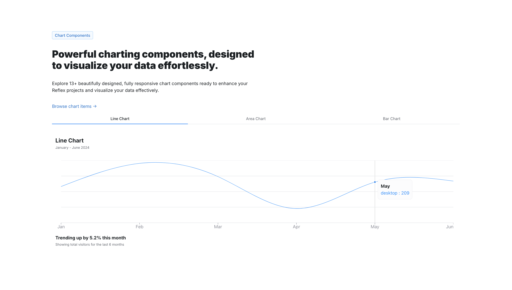

# ReflexUI 
 
Pre-designed UI components built with Reflex. Easily copy and paste into your own app. 

  

## Pantry

Visit the [Pantry](https://reflex-ui.reflex.run/pantry/animations/) section to view the available pre-built components. 

## Charts

Visit the [Charts](https://reflex-ui.reflex.run/charts/area-charts/) section to view the available pre-built charts for data visualization. 

## Interactive Apps

Visit the [Interactive Apps](https://reflex-ui.reflex.run//interactive/retrieval-augmented-generation/) section to view the available interactive apps (A.I., Chatbots, etc..). 

## Contributing

Please read this [guide](CONTRIBUTING.md) for more information on how to contribute. 

## License

Licensed under the [MIT license](LICENSE).